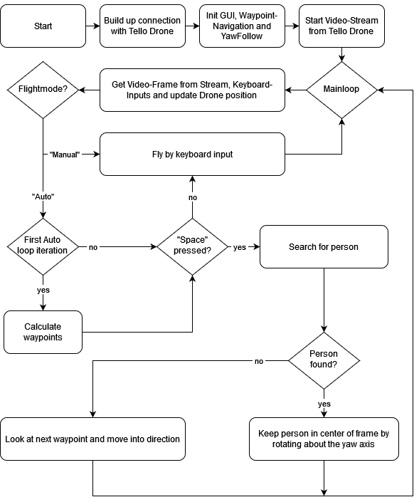

## Tello Drone Educatianal AI Project
### 1. Introduction
This Repository aims to show a use-case of the [Tello drone](https://www.ryzerobotics.com/de/tello) from Ryze. This drone can be controlled via a simple python API.

The general idea of this project is to use the drone for simple search and rescue missions. It can search for persons in a given area. When a person is found it will notifiy the operator and keep it in the center of its videofeed. If there is no person detected, the drone will follow a list of waypoints. At any given time the user is able to overwrite the current state and take control of the drone.
The whole system is described in the following flowchart:



A more detailed documentation can be found under [docs\_build\html](docs/_build/html) as a .html page, just open intex.html in your browser of choice.
### 2. Installation
to install all neccessary packages, just run the following command:
```bash
pip install -r requirements.txt
```

### 3. Usage
before starting the program you have to connect to the drone via Wi-Fi. To start the program, just run the following command:
```bash
python main.py
```
It will open a window with the camera stream and two buttons, "Auto" and "Manual". If you select "Manual" you can control the drone manually. If you select "Auto" the drone will compute the search area according to the user input. For the drone to perform the search you have to keep the the Space-Bar pressed while in "Auto".


### 4. Controls
| Key   | command          |
|-------|------------------|
| DOWN  | move back        |
| UP    | move forward     |
| LEFT  | move left        |
| RIGHT | move right       |
| W     | move up          |
| S     | move down        |
| A     | rotate left      |
| D     | rotate right     |
| L     | Takeoff and Land |
| SPACE | deadman switch   |

### 5. Known Issues
```bash
Exception: Command 'command' was unsuccessful for 4 tries. Latest response:     'Aborting command 'command'. Did not receive a response after 7 seconds'
```
the computer is not connected  to the drone. Check the wifi connection and try again.

The videofeed will be interrupted during takoff and landing and the GUI won't respont either, it will work normally after a few seconds.

